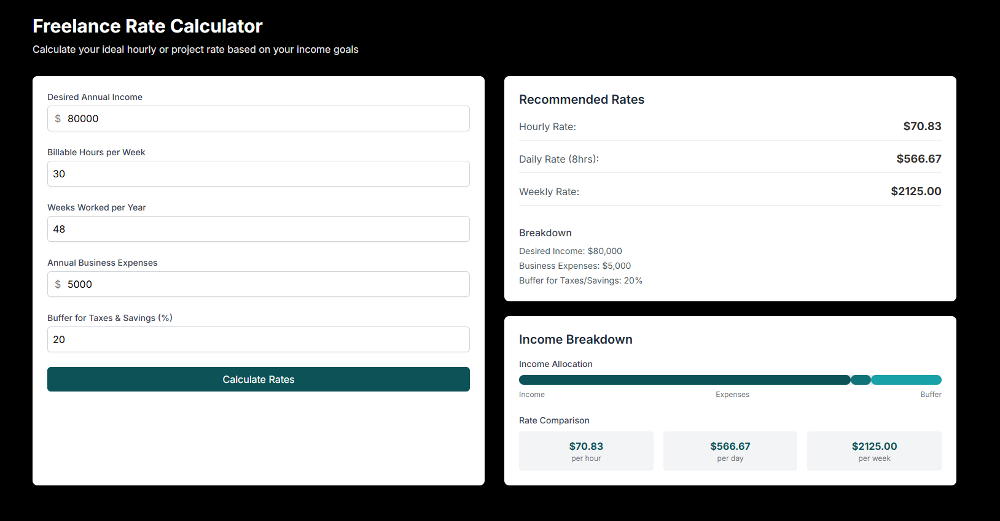

# 💼 Freelance Rate Calculator

A smart, intuitive calculator built with Next.js, TypeScript, and Tailwind CSS that helps freelancers determine their ideal hourly, daily, or project rates based on expenses, desired income, and workload.



Live Demo: [freelance-rate-calculator-pro.vercel.app](https://freelance-rate-calculator-pro.vercel.app/)

---

## ✨ Features

- 💵 **Rate Types**: Hourly, Daily & Weekly rates  
- 📊 **Expense Tracking**: Business costs + tax buffer (20%)  
- 🎯 **Income Goals**: Target annual income ($80,000)  
- 🔢 **Workload Adjustments**: Billable hours (30h/week) + weeks worked (48)  
- 📱 **Fully Responsive**: Mobile-friendly design  

---

## 🚀 Tech Stack

- **Framework:** [Next.js](https://nextjs.org/)
- **Language:** [TypeScript](https://www.typescriptlang.org/)
- **Styling:** [Tailwind CSS](https://tailwindcss.com/)
- **Deployment:** [Vercel](https://vercel.com/)

---

## 📦 Installation

```bash
git clone https://github.com/Alirazahaider/freelance-rate-calculator
```

```bash
cd freelance-rate-calculator
```

```bash
npm install
```

```bash
npm run dev
```

## 💌 Get In Touch

Thank you for checking out this project! If you have any questions, suggestions, would like to collaborate, or need my development services:

[](mailto:alicodespace@gmail.com)
[](https://www.linkedin.com/in/alirazaweb)
[](https://alicodez.vercel.app/)

⭐ Support the project by starring the repository!
[](https://github.com/Alirazahaider/freelance-rate-calculator)
